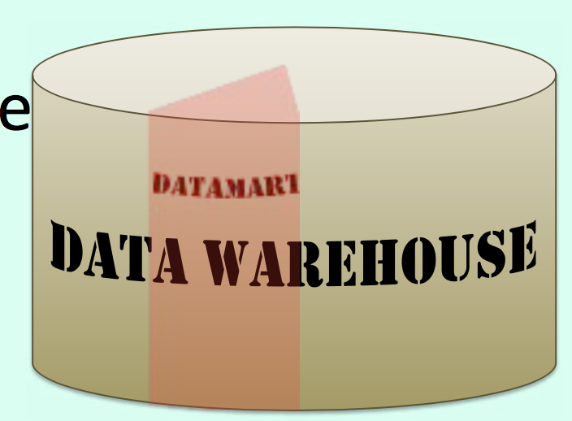
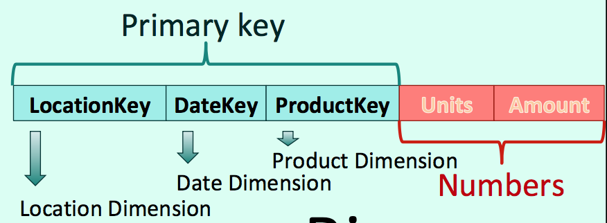

# Decision Support System

Data Warehousing

## On Line Transaction Processing (OLTP systems)

systems taht record orders, production, billing and so forth. Characterized by short transactions that are executed large number of times.

Having longer term data (historical data) and additional data means that we'll have to deal with possibly far more data than operational databases.

What will be big may not be so much what we STORE, if we aggregate data, but what we PROCESS, because aggregation is a costly operation.

Different Grain of Information -> Aggregate

## Aggregating takes time

Aggregates, unfortunately, require by definition processing huge volumes of data, sorts, and computations all along. All operations that require I/ Os and CPU. The workload is completely different from an operational database workload and this is why data warehousing and business intelligence are considered a topic apart in information systems.

## Data Warehouse

Bill Inmon, 1990s

Shdow IT vs. Official IT

Because databases are huge, schemas are complicated and queries difficult to write, a large number of people, especially in higher circles, were mostly working with figures extracted from various sources (including printed reports), and that a lot of strategic data was living outside "official IT"

This shadow IT mostly lives in spreadsheets, shared by email or (today) in a public cloud. Needless to say, data organization is poor, consistency weak, several versions circulate, and security is low.

Inmon basically suggested creating a single repository that would act as a reference and could be managed with professional (IT) standards.

Definition: **a subject oriented, nonvolatile, integrated, time variant collection of data in support of management's decisions**.

("themes", Read only, Clean, Historical data)

### Peculiarities

This repository should be distinct from operational databases not only because the schema might be different, but because the query patterns will be very different, with almost no repeated queries (or repeated only once a day, week or month)

- Read only
  - we can index happily
- Disposable queries
  - we can hard-code happily

Data is periodically uploaded from databases and other operational sources.

### Datamarts

Coherent subsets are extracted to create "datamarts".



Reduce the scope, data domain, volume.

### ETL (Extract/Transform/Load)

Availability requirements will also be low compared to operational databases. Dataware House uploads are scheduled on a regular basis, every night, every week-end, or whatever your needs are.

> Don't underestimate "Extract/Transform/Load" (ETL) processes. Extraction mustn't interfere too much with operations. Transformation and loading may be complicated (it has spawned an entire industry of tools)

#### Purpose

To outsmart competition

#### Problem

Generating efficient queries for people who cannot spell SQL

#### Inmon's Top-down 3NF Approach

An enterprise has one data warehouse, and data marts source their information from the data warehouse.

#### Kimball's Bottom-up 2NF Dimensions Approach

starting with quickly designed, denormalized datamarts in departments.

Departmental datamarts, the data warehouse is the enterprise-wide collection of datamarts.

> Every non key attribute must provide a fact about the key (1NF), the whole key (2NF), and nothing but the key (3NF).

**2NF**: Some columns store data derived from other columns

## Concepts of Data Warehousing

### 1. Facts and dimensions

Facts, to make it simple, are principally figures.

Dimensions are the axes along which these figures can be aggregated (as we are in a world where we want synthesis).

> I'd like to see sales in USD per country, month and per line of product.

> This is a typical managerial request. Sales are facts. Everything that follows a "per" is a dimension. Simple.

### FACTS table

A facts table is big. Its composite PK is made of FK to dimensions. The more dimensions, the finer the grain (the level of detail you can obtain). Other columns are (usually) numbers.



**All facts aren't equally suitable for aggregation.**

- Additive facts

Can be summed up for any dimension

- Semi-additive facts

Can be summed up for some dimensions

- Non-additive facts

Cannot be summed up

**Date dimensions illustrate perfectly the Kimball approach.**

> Kimball's reasoning is the following: if I store a date column, that will be difficult to query. If I want to aggregate by date or month, I'll need to apply (complicated and different in all DBMS products) date functions that I'll never be able to index because most date functions are NOT determininistic. The day is likely to be my smallest time unit. What are 20 years, with one row per day? Under 7,000 rows? Very tiny today. Let's have one row per date, and decline each date under every possible form, and index every column.

We'll store date hierarchies that will ease aggregates.

Year, Querter, Month, Week, Day

### 2. Stars and snowflakes

When you just have one facts table surrounded by
dimensions, you have a "star schema".

With additional joins you get a snowflake and Kimball dislikes it.

### 3. Slowly Changing Dimensions

The problem is that dimensions change over the years.

> Take stores, for instance ("per store" could be an interesting sales result): new stores can be opened, other stores closed, a store can move to better premises in the same city.

One way to handle them is to ignore them.

#### Type 0 SCD

Keep as it was first inserted

#### Type 1 SCD

Update dimension - lose old record

#### Type 2 SCD

Add a new record –- Disconnect old facts/new facts

#### Type 3 SCD

Add old/new/date information to the dimension

In practice most SCDs are type 1 or 2.

#### Data Manager

All this of course requires due consideration and has created a new job of Guardian of the Data.

## Aggregate Fastly

- Speeding up aggregates
- Pre-computing aggregates


### Bitmap indexes

`What was the sum of sales per state and month last year?`

> We'll return at most 50x12 rows, which is peanuts. We'll scan a small table of states, and a small table of dates. Neither "state" nor "month" will be very selective.

Because of 2NF, cardinality is often low.

For low cardinality columns, advanced products such as Oracle implements "bitmap indexes". Their entries are chunk of bits that cover many rows and contain a bit that says whether the row contains the key or not.

```
MON 10000001000000100000010000001000000
TUE 01000000100000010000001000000100000
WED 00100000010000001000000100000010000
THU 00010000001000000100000010000001000
FRI 00001000000100000010000001000000100
SAT 00000100000010000001000000100000010
SUN 00000010000001000000100000010000001
```

The advantage of bitmap indexes is that by applying AND and OR operations to the bitmaps you can quickly identify the rows that satisfy several conditions (Shenzhen and November) and fetch them.

### Star Transformation

This transformation is just adding redundant conditions that make the choice of the suitable plan irresistible to the optimizer.

Oracle also implements a parameter that enables the "star schema transformation"

These redundant conditions are added for every dimension in the query.

Once you know exactly which rows you want, you can prey on them in the big table.

### Database Machines/Appliances

Several companies have created dedicated hardware that is more specially geared towards the data warehouse type of queries. Some databases, called columnar databases, store data by columns rather than rows to speed up aggregates.

### Precomputing aggregates

Another, simple way to speed up aggregates is NOT to compute them on the fly but, if we have an idea about the aggregates that will be computed most often, to precompute them every time we upload the database, at least partially.

### Materialized Views

**NOT views**

"Materialized views", which are actually tables, are saved query results (very often aggregates) that are prescheduled and automatically refreshed. You can query the materialized view directly, but some optimizers are smart enough to recognize when they can use a pre-computed result in a query on the original table. It's OK on data that isn't "real time data".

`View = saved query text`

`Materialized view = saved query result`

You specify in the creation statement the refresh schedule. It can be a full cancel and replace or, sometimes, an incremental refresh that requires a trigger-populated log on the original table(s).

Some products go further and try to compute every possible aggregate possible, detail AND all possible sums. If you don't ask for anything that strays from the predefined path, you get immediate results.

Things become funny when you have MANY dimensions – the number of combinations explodes ...


...
