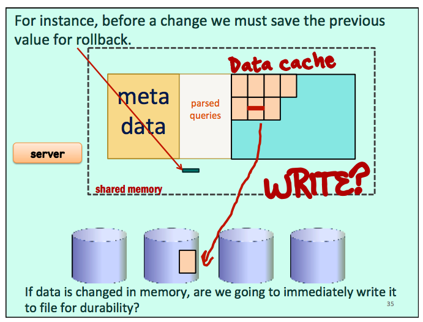
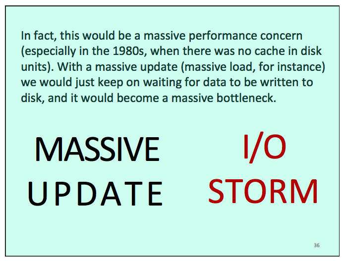
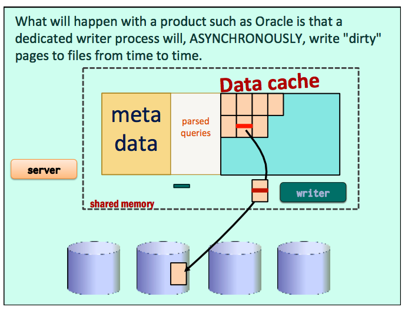
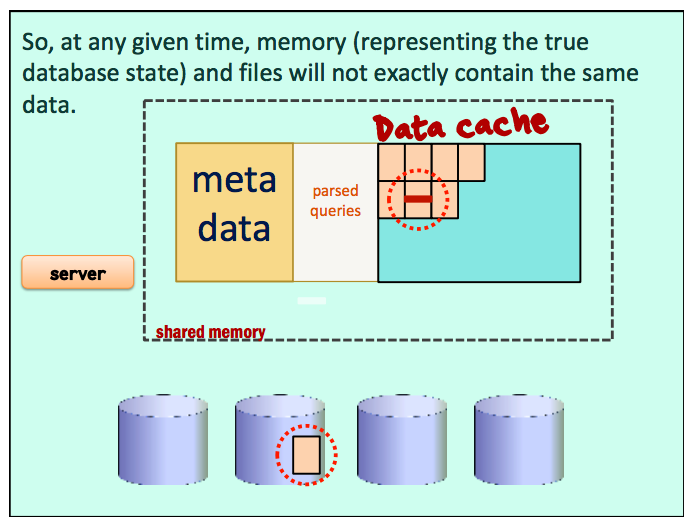
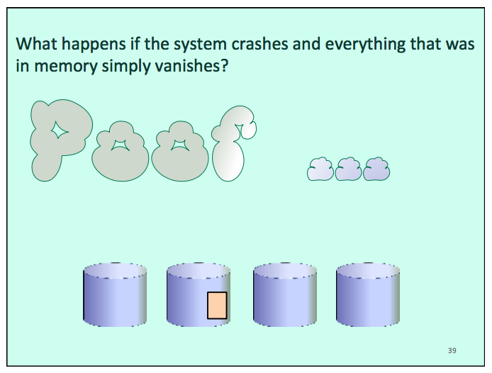
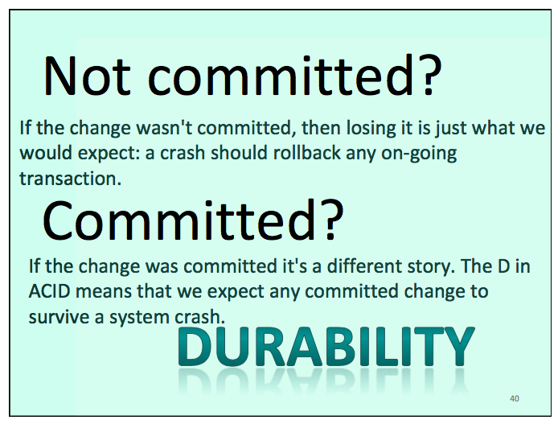
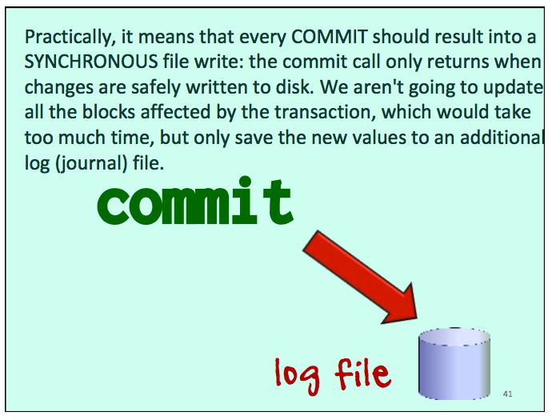
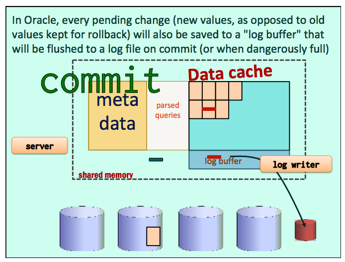
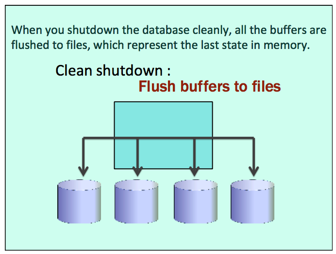
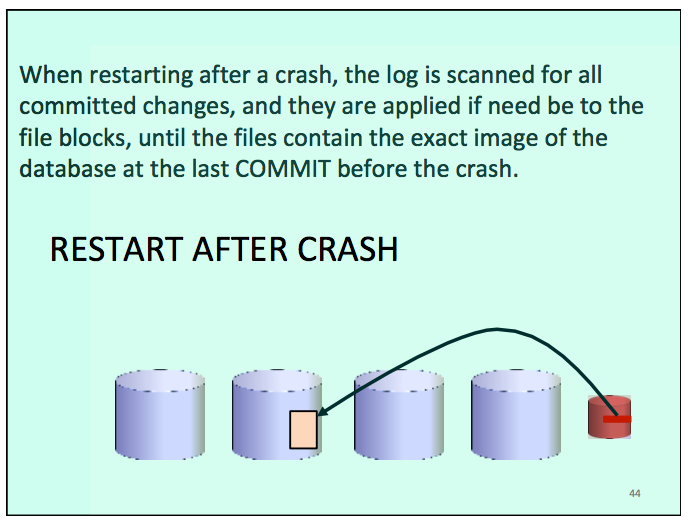

# Lecture 10

## Parsing

~ Dynamic compilation

### Query Optimizer

Parsing takes time.

Keep parsed queries in memory.

#### Query cache management

Least Recently Used (LRU)

Checksum + check tables are same and context identical

#### Binding queries

To help cache queries, we should use parameters and "bind" them at run time. The text of the query is unchanged whichever name we attach to it.

```sql
select m.title, m.year_released
from movies m
     inner join credits c
     on c.movieid = m.movieid
     inner join people p
     on p.peopleid = c.peopleid
where p.first_name = :first_name
  and p.surname = :surname
  and c.credited_as = 'D'
```

And unfortunately you cannot bind a table or column name, nor (which would be quite useful) a whole list of values.

```sql
select ...
from :my_table
where col in (:user_list)
order by :user_choice
```

#### Selectivity?

The optimizer will base its decision on the values passed when the query is first parsed. Nothing guarantees that the decision will still be adequate with other parameter values.

#### Cache Query Result

More radical, Read Only/Slowly Changing

Some products can go further than caching parsed queries and can even cache results associated with a query and its parameters.

It's OK if the database is a read-only database or changes only very slowly (for instance, for a query such as retrieving the last articles in a blog).

**SEVERAL problems**

Atomicity Transactions (rollback)

Durability
Persistence
Consistency

Isolation Concurrency

### ACID

- Atomicity

Related to a transaction, seen as a single unit.

- Consistency

Data should always be seen as consistent (constraints)

- Isolation

When one user changes data, it should not make it inconsistent to others

- Durability

When something is saved to a database, it should become persistent, whatever happens












#### What about several sessions?

**Dedicated Sessions**

Assign to all connected users their own personal server process running SQL for them.

**Session Pooling**

Pre-start (which makes connection slightly faster) a number of servers, and to assign requests to them with a bit of load-balancing.

## What about a session querying data being changed by another session?

The main problem is that a transaction can last "a certain time". You may need to run a lot of code before deciding on commit or rollback.

```sql
Begin Transaction

Commit
```

During the transaction, the database will be in a kind of transient state of which you cannot say whether it will become permanent.

CONSISTENT STATE

Between two consistent states, you have a kind of black hole.

### 4 levels for [ISOLATION](https://en.wikipedia.org/wiki/Isolation_(database_systems))

The SQL standard defines four isolation levels, from no isolation at all to paranoid. Some products let you set it, others impose it.

- ~~dirty reads~~
- read committed
- repeatable read
- serialization

> Let's see once again how a transaction works. You start it. Before applying any change the DBMS saves the value from before your transaction, in case you'd want to rollback. Then you commit (or rollback) and the value previously saved for rollback (in memory or on file) can be marked as disposable.

#### ~~Read Uncommitted (dirty read)~~

> If when a user is changing data another user were able to read the new value before being sure that there will be no rollback, we would run into problems pretty soon.

#### Read Committed

> But the "old" value belongs to a stable (committed) state of the database. What most DBMS products will do is that they will "serve" to the reader this value, at least known to be consistent and to have been once "official current value".

#### Repeatable read

Point-in-time read

> However, once the writer has committed, in the read committed model whe should read the new, now official, value. It may be inconsistent with a previous read and we may favor consistency for the reader over timeliness.

> In practice, the problem is more a problem of data consistency of foreign keys when we are scanning big related tables. A single SELECT will usually be consistent (a product such as Oracle ignores any change having happened since the start of the SELECT, even if it was committed). But if we SELECT twice (two different queries) from two tables with an FK relationship, changes that may have happened (and have been committed) between the time when we started reading the first table and the time when we were reading the second table may lead to problems such as orphaned rows.

> Example: If I haven't read an uncommitted order when reading ORDER, then I should ignore rows refering to this order in ORDER_DETAIL even if they have been committed by the time I reach them.

#### Serialization

The last level is to block readers when data is being modified. Guaranteed to be consistent but bad for performances.

When you have twowritersyou cannot do otherwise than locking.

#### BACKUP ISSUES

#### SCALING UP

Adding servers

Neil Gunther’s
Universal Law of Computational Scalability

# Lab 11

[Slides](lecture10/Lab11.pdf)

[INFORMATION_SCHEMA (PostgreSQL Version)](https://www.postgresql.org/docs/9.6/static/information-schema.html)

## Data Dictionary / Catalog

A set of tables that contain information about the objects in the database.

One catalog per database.

### System tables

Any database stores "metadata" that describes the tables in your database (and not only them).

All client tools use this information to let you browse the structure of your tables

Whenever you are issuing DDL commands, you are actually modifiying system tables. They must NEVER be directly changed.

Read access to these tables is provided through system views.

In these views you only see what YOU are allowed to see. Only administrators see everything.

#### Most important tables for developers in `INFORMATION_SCHEMA` (PostgreSQL version)

- `TABLES`
- `COLUMNS`
- `TABLE_CONSTRAINTS`
- `CONSTRAINT_COLUMN_USAGE`
- `KEY_COLUMN_USAGE`
- `CHECK_CONSTRAINTS`

`SEQUENCES` `ROUTINES` `TRIGGERS` `VIEWS`

`VIEW_TABLE_USAGE`

Those are all views you should be aware of.

**Nothing on indexes not associated with PK or UNIQUE constraint!**

Must look into `pg_catalog`.

- `pg_index`
- `pg_class`
- `pg_attribute`

#### Stuff mostly for DB administrators

Roles and privileges

- `pg_class` relates tables to files on disk
- `pg_statistic` estimates used by the optimizer
- `pg_settings` database parameters


...
