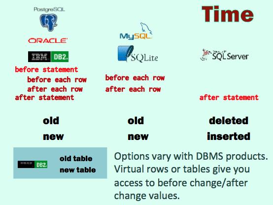

# Lecture 8

## Procedures

- Business processes
- Avoid cursors
- Use `insert` ... `select` and complex `update`s

### Lab 8

### Store for REUSE

- Sequence of change operations
- Single business process
- Avoid `begin transaction` / `commit` inside

> `commit` is a slow operation (it usually means writing to a file) and it may hurt if the procedure is called repeatedly.

May spent a lot of time in the network if running a business procedure in a remote server.

Advantages

- A single version to maintain
- Excute directly on the DBMS server
- Security, all changes follow the rules

`create procedure myproc`

`execute myproc`

### Function that returns `void`

**PostgreSQL** is the only product for which, probably under the influence of languages such as C or Java, **procedures are just functions that return nothing**.

```sql
--
--  A procedure to register a film
--
create function movie_registraction
  ( p_title         varchar,
    p_country_name  varchar,
    p_year          varchar,
    p_director_fn   varchar,
    p_director_sn   varchar,
    p_actor1_fn     varchar,
    p_actor1_sn     varchar,
    p_actor2_fn     varchar,
    p_actor2_sn     varchar)
returns void
as $$
declare
  n_rowcount  int;
  n_movieid   int;
  n_people    int;
begin
  insert into movies(title, country, year_released)
  select p_title, country_code, p_year
  from countries
  where country_name = p_country_name;
  get diagnostics n_rowcount = row_count;
  if n_rowcount = 0
  then
    raise exception 'country not found in table COUNTRIES'
  end if
  n_movieid := lastval();

  --
  -- Count how many people were "provided" in the parameters
  -- (some of them could be NULL)
  --

  select count(surname)
  into n_people
  from (  select p_director_sn as surname
          union all
          select p_actor1_sn as surname
          union all
          select p_actor2_sn as surname) specified_people
  where surname is not null;

  --
  -- Get people identifiers and insert into table credits
  --
  insert into credits(movieid, peopleid, credited_as)
  select n_movieid, people.peopleid, provided.credited_as
  from (select coalesce(p_director_fn, '*') as first_name,
               p_director_sn as surname,
               'D' as credited_as
        union all
        select coalesce(p_actor1_fn, '*') as first_name,
               p_actor1_sn as surname,
               'A' as credited_as
        union all
        select coalesce(p_actor2_fn, '*') as first_name,
               p_actor2_sn as surname,
               'A' as credited_as) provided
       inner join people
         on people.surname = provided.surname
        and coalesce(people.first_name, '*') = provided.first_name
  where provided.surname is not null;
  get diagnostics n_rowcount = ROW_COUNT;
  if n_rowcount != n_people
  then
    -- My choice is to cancel everything ("raise" will
    -- generate a rollback of the whole procedure, the
    -- successful insert into movies will be cancelled)
    raise exception 'Some people couldn''t be found';
  end if;
end;
$$ language plpgsql;
```

```sql
select movie_registration('The Adventures of Robin Hood',
   'United States', 1938,
   'Michael', 'Curtiz',
   'Errol', 'Flynn',
   null, null);
```

Use `perform movie_registration(...)` inside another procedure.

### Catch exceptions

```sql
begin -- same as'try'
...
exception -- same as as 'catch'
  when ... -- exception name here
end;
```

`unique_violation`

### Using cursors

```sql
declare
  c cursor for select ...;
begin
  for row_var in c
  -- Inside the loop, you can refer to row_var.col_name
  loop
    ...
  end loop;
  ...
end;
```

**DDL operations are usually unsupported by stored procedures.**

> A `CREATE TABLE` (or `ALTER TABLE`) in a procedure will fail.

BUT you can cheat.

```sql
begin
  ...
  cmd := 'create table T ...';
  execute cmd;
  ...
end;
```

### Create a daily copy of tables

- `INFORMATION_SCHEMA` contains "System Views" that describe the database (tables, columns, constraints).
- `CREATE TABLE ... AS SELECT` let you copy structure and data. However, the copy is imperfect.
    - all columns are created nullable
    - constraints and other features we'll see later are "forgotten"

```sql
--  An example where using a cursor is fully justified.
--  The procedure queries the catalogue to check the tables
--  in the current schema, and creates a copy (with the date in the
--  name) of every table for which no copy was created today and
--  that isn't itself a copy.
--  There is no way to do it without a cursor.
create or replace function save_tables()
returns void
as $$
declare
   v_suffix      varchar(50);
   v_create_cmd  varchar(100);
   c cursor for select replace(table_name, v_suffix, '') as table_name
                from information_schema.tables
                where table_schema = current_schema()
                group by replace(table_name, v_suffix, '')
                having count(*) = 1
                    and replace(table_name, v_suffix, '') not like '%_save_%';

begin
  select '_save_' || to_char(current_date, 'YYMMDD')
  into v_suffix;
  for fetched_row in c
  loop
    v_create_cmd := 'create table ' || fetched_row.table_name || v_suffix
                    || ' as select * from ' || fetched_row.table_name;
    execute v_create_cmd;
  end loop;
end;
$$ language plpgsql;
```

## Triggers

For excuting stored procedures automatically.

**Fired by data changes** (never by a `SELECT`). [See below]

- Modify input on the fly
- Check complex rules
- Manage data redundancy

### Trigger Activation

Depending on what the trigger is designed to achieve, it may be fired by various events and at various possible precise moments.

  - before/after `insert` trigger
  - before/after `insert` for each row trigger

#### Time


#### Event
- `insert`
- `update`
- `delete`

Several possible triggers.

Several possible events can fire one trigger

#### PostgreSQL, Oracle, IBM DB2

Some products let you have several different events that fire the same trigger (timing must be identical).

```sql
create trigger trigger_name
before insert or update or delete
on table_name
for each row
as
begin
  ...
end
```

#### MySQL, SQLite

Other products allow only one trigger per event/timing, and one event per trigger.

```sql
create trigger trigger_name
before delete
on table_name
for each row
as begin
  ...
end
```

#### SQL Server

SQL Server is a bit special. Triggers are always after the statement, and syntax is different from other products. But several events can fire one trigger.

```sql
create trigger trigger_name
on table_name
after insert, update, delete as
begin
  ...
end
```

### 1. Modify input on the fly

> For instance, you want to make sure that data is always in lowercase but the (bought) data entry program doesn't enforce it.

```sql
before insert / update
for each row
```

> SQL Server: midify by joining on inserted

### 2. Check complex rules

```sql
before insert / update / delete
for each row
```

> SQL Server: check by joining on inserted and deleted. Roll back if something wrong.

### 3. Manage data redundancy

```sql
after insert / update / delete
for each row
```

> SQL Server: deleted/inserted

> A third case is managing some data redundancy (which means some duplication of data). A trigger can write in your back to another table.

> In the film database, this is done for titles: words are automatically isolated and added to MOVIE_TITLE_FT_INDEX2 whenever you add a row to MOVIES or ALT_TITLES.


```sql
create or replace function people_audit_fn() returns trigger
as
$$
begin
  if tg_op = 'UPDATE'
  then
    insert into people_audit(...)
    ...
  elsif tg_op = 'INSERT' then
    insert into people_audit(...)
    ...
  else
    insert into people_audit(...)
    ...
  end if;
return null;
end;
$$ language plpgsql;
```

> Notice that the initial "returns trigger" is completely dummy. We can return anything, null is OK.

```sql
create trigger people_trg
after insert or update or delete on people
for each row
execute procedure people_audit_fn();
```

**Beware of FOR EACH ROW triggers, you cannot do anything in them.**

### Unique Constraint

PostgreSQL

```sql
create table test
  (id int, label varchar(20),
    unique(id) deferrable initially deferred);
```

> Consistency andconstraintsarechecked AFTER the update, not DURING. During the update, the state is undefined.

**DON'T look at other rows of the modified table in for each row triggers.**

**If you can, avoid triggers.**

- Don't use triggers to fix design issues.
- Use stored procedures preferably to triggers.
- Use triggers if there are multiple access points (other than your programs).

## Speeding Up

### Index

Two columns often queried together can be indexed together; what is indexed is concatenated values (NOT separate values)

Whenever you declare a `PRIMARY KEY` or `UNIQUE` constraint, an index is created behind your back.

Additionally, indexes use a lot of storage, sometimes more than data! It has a huge impact on operations (regular activities such as backups).

You can also declare an index to be unique.

```sql
create unique index <index name>
on <table name>(<col1>, ... <coln>)
```

Use Unique constraint instead of Unique index.


...
