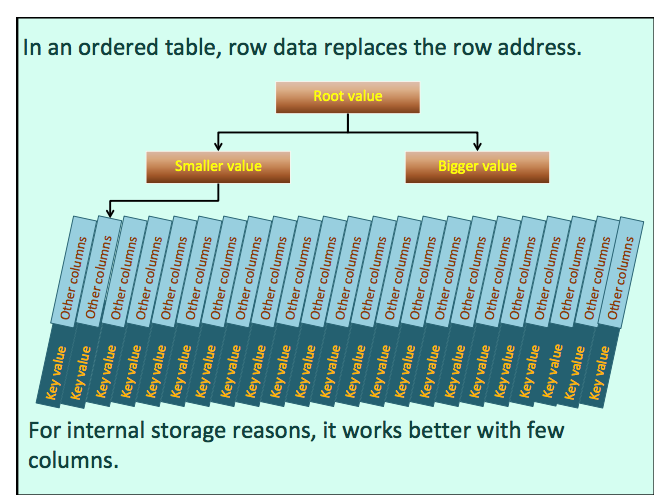

# Lecture 9

### Index

#### Naming Standards

**prefix**

`IDX_ MYTABLE_SOMECOL`

**suffix**

better choice since all related objects are grouped together when listed

`MYTABLE_SOMECOL_IDX`

#### Performance

**Indexes massively improve performance.**

When we scan a table, the time to scan it is irrespective of how many rows we'll find to return.

What you are using and how you are doing it actually depends on **how much data you are retrieving**.

**DO NOT index on all columns.**

Indexing every column means, that every INSERT will have to write not only into the table but into every index.

**Which columns to index?**

search criteria often used

The column must be **SELECTIVE**, that means that the values it contains are **rare** and correspond to very few rows.

The big problem is with the distribution of values. The optimizer may decide not to use an index depending on the statistics.

#### Explain "execution plan"

`explain <select statement>`

SQL Server: `set showplan_all on`

In this execution plan, you see tables and indexes that are accessed.

Depending on the DBMS, the "explain" command will display the plan directly or populate a table that must be queried.

**There are no "good" or "bad" execution plans.**

The main benefit of execution plans it to check whether the optimizer is more or less doing what you thought it would do.

#### Unuseable index cases

- Composite indexes

The key is concatenated values from several columns. Only can be used if the lead column(s) appear in the query.

- `like '%something%'`
- `SUBSTR()`
- More generally, `function()`
- Case-sensitive DBMS

A typical, and common, problem is to perform, with a case-sensitive DBMS a case insentive search in a column when data is in mixed case.

`where upper(surname) = upper('some input')`

- Functions that extract date parts

Use them in a WHERE clause, your index is dead. You should **always express conditions on dates as range conditions**.

- Implicit conversions (wrong direction)

#### Applying function to an indexed column

In some other cases, though, the search MAY require applying a function to the indexed column.

```sql
select *
from people
where soundex(surname) = soundex('Stuart')
```

What you can do for instance is add a column that stores the soundex.

This happily violates the rules of good normalization (... it depends on another column that is a part of a key), but then you can index it and apply the search to this new redundant column.

- insert
- trigger

#### Deterministic

Most products actually allow you to do something cleaner by indexing an expression (sometimes called "generated" or "virtual" column), which can be the result of a function.

It only works if the expression or function is **deterministic**.

"Deterministic" means that the same input will always generate the same output.

Many commonly used functions aren't deterministic because their result is affected by database settings (localization settings most often).

`dataname(month, '1970-01-01')` is not deterministic because of language setting.

`upper(column_name)` is deterministic.

#### Define Constraints with an eye to Performance

- the order of `unique` constraint

#### Store rows in a given order

**Heap-organized table**

A regular table (unordered)

**Clustered index / Index-organized table**

A ordered table



### Rows ordered by the key value

Much used with SQL Server (almost standard) and with MySQL/InnoDB, and rarely with Oracle.

#### Benefits

- Table is an index on a key, no additional index on that key
- Walk your tree and find data, not an address requiring an access to something else
- Range of values in succession

#### Drawbacks

- When updating the key, it's moving around a whole row instead.
- Inserting may involve shifting around a lot of bytes to make room.

## View


```sql
create view viewname (col1, ..., coln)
as
select ...
```

> Views are just the relational equivalent of functions: the ability to store (and reuse) a relational expression, in other words something that returns a relation and not simply a value like what you usually do with a stored function.

- Permanent object
- Permanent structure

> Views are permanent objects in the database - needless to say, their content will change with the data in the underlying tables, but the structure will remain constant and can be described in the same way as the structure of a table can be described: columns are typed.

Columns added later to tables in the view won't be added even if the view was created with SELECT * (bad practice).

### Simplify queries

### Hide complexity

> The problem with views is that as long as you haven't seen how they have been defined, you have no idea how complex they may be. They may be fairly innocuous, or they may be queries of death (they often are)

### Scalability

Slower query to retrieve the same data = Fewer simultaneous users served

### Three areas where views are useful

- Reports
- User Interface
- Security

# Lab 9 Privileges and View Update

## Privileges

`grant <right> to <account>`

`revoke <right> from <account>`

Data Control Language

Privileges fall into two categories:

- System Rights

give users the right to issue DDL commands and change the structure of the database.

- Table Rights

privileges to access and change the data.

```sql
grant select, insert on tablename
to accountname

revoke privilege on tablename
from accountname

-- All products have a way to grant a (low) privilege to everybody,
-- existing as well as future users.
grant select, insert on tablename
to public
```

The UPDATE privilege can also be restricted to some columns only

### How can views help with security?

The trick is to use a view that only shows what people are supposed to see, and grant SELECT on the view and not on the table.

Beware when you modify the definition of a view:

If you simply drop and recreate it, you lose the privileges. Use `CREATE OR REPLACE`

**In many cases, view update is simply impossible.**

In some cases, view update is quite possible.

There is no problem if the view update maps to a simple table update.

There is one special constraint, though, that exists for views: `WITH CHECK OPTION`.

It prevents you from making a change that will make a row disappear from the view (other than a DELETE)

If updating the view directly is impossible, in many cases what should be applied to base tables is fairly obvious and can be performed by dedicated **stored procedures**.

#### `instead of trigger`

A speicial type of trigger

It can be created on a view and lets you call a procedure "instead of" performing the triggering.

...
