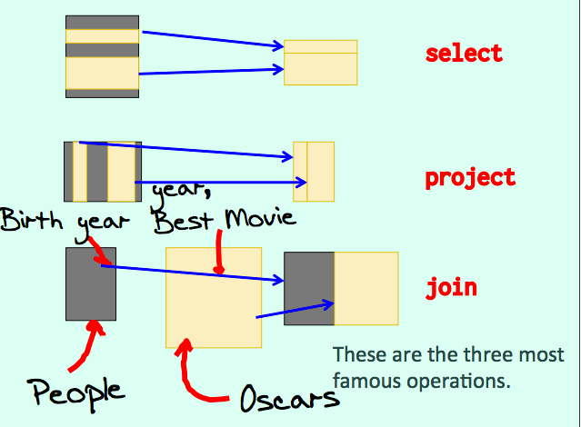
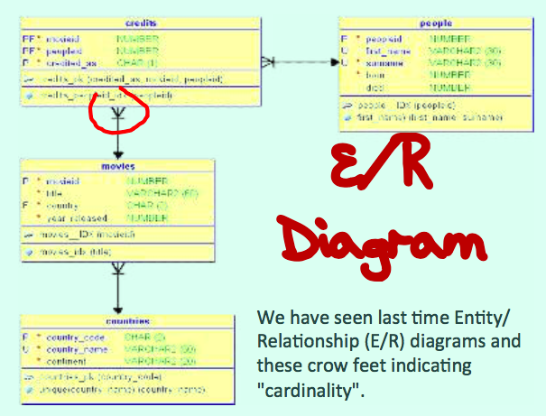
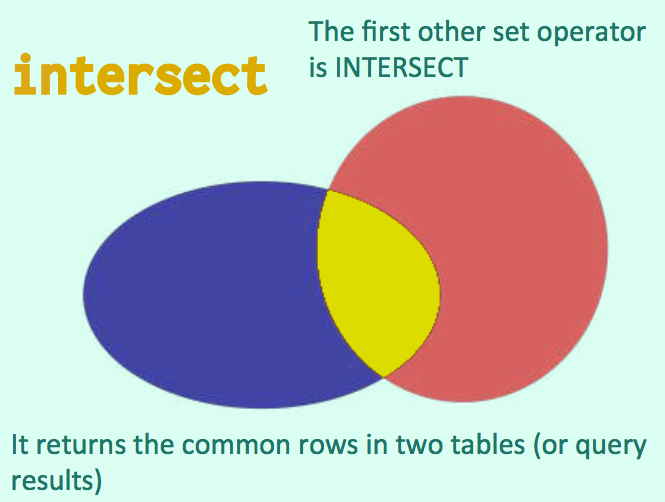
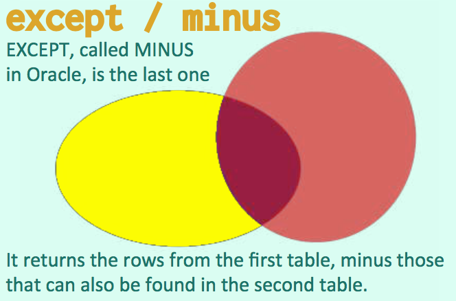
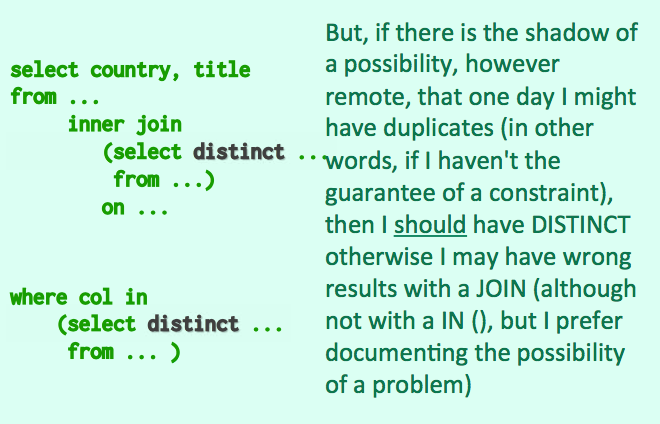
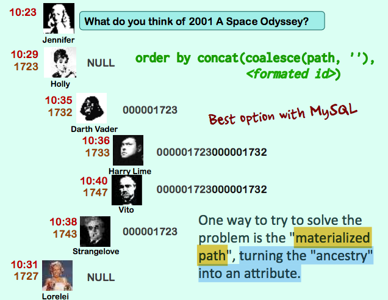
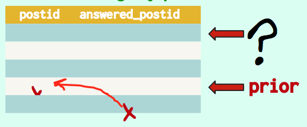
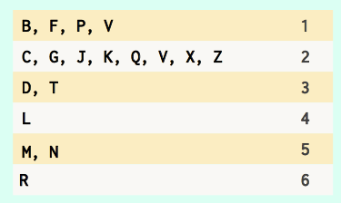
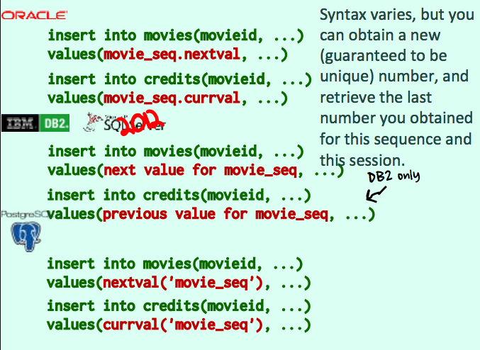

# Database Principles Mid-term Exam Review

# Lecture 1

- No books required
- Avoid textbooks, use professional books

Grade | Percentage
-- | --
Midterm | 24%
Midterm | 25%
Lab & Quizzes | 20%
Final Exam | 25%
Project* | 30%

\* Groups of 3 or 4 for project

**Information** Data with a meaning

> Store data is mostly text, numbers, dates, and (less onen) mulfmedia documents.

### Purposes of Databases

### RETRIEVE data
as efficiently as possible.

## Relational Theory
1970

Edgar F. Codd 1923 - 2003


Each column in the table stores a piece of data, and one row represents a "known fact".

All the pieces of data in a row are related, hence **"relational"**.

### Operate on relations
Codd's big idea was that as relations are well known mathemafcal animals (sets), you could operate on them, and get new sets.



> If tables are variables, you can change their content massively, and combine them in complex operafons to obtain new results, as you could with numbers.

## Modeling

Before you can do fun operafons with tables, you must design your database well, a step known as modelling.

First of all, you must know which data you need/want to manage. It depends on whom you are.

### Film Database

Duplicates are forbidden in relational tables.

#### Key

What differentiates one row from another.

Key cannot be changed.

> For purely commercial reasons, though, it may be assumed that the combinafon title/country/year of films will be unique.

#### Primary Key

####  Normalizafon

**First Normal Form**

Each column should only contain ONE piece of informafon.

### Making the right choices

Most choice revolves along assessing whether an attribute is or can be considered **unambiguous** or whether even unusual cases are important and could break everything, in which case you may need to split data between two or even three tables.

### Entity

In a database model, you call "entity" something that has a life ot its own. eg. people, films, countries.

Relationships connect entities. They have no life of their own.

> If a film project is abandoned, there will be no rows for this film in CREDITS.

An "Enfty Relafonship Diagram" (E/R Diagram) is a way to represent tables in a database (you even have hundreds of tables in a diagram). Crow feet indicate **"cardinality"**.

# Lecture 2



> "Cardinality" is just a complicated word to say "number".

## Cardinality

### `(1, n)`

There is always one country per film, but there are several films per country.

### `(0, n)`

In some cases, some attributes haven't always a value; "main language" for instance, because you have silent films.

### `(m, b)`

Several actors usually appear in a film, and an actor usually plays in several films.

`(m,n)` cardinality implies a relationship table.

## Normalization
All about splitting

### 1 Simple Attributes

### 2 Attributes depend on the full key

### 3 Non-key attributes not dependent on each other

>  Every non key attribute must provide a fact about the key, the whole key, and nothing but the key. -- William Kent (1936 - 2005)

## Query Language

- ALPHA
- SQL (born SEQUEL, Don Chamberlin with Ray Boyce)
- QUEL (Michael Stonebraker)
- QBE (Query By Example, Moshe Zloof)

Oates, Ellison, Miner - The founders of Oracle

## Two Main Components of SQL

### Data Definition Language
deals with tables

```sql
CREATE
ALTER
DROP
```

### Data Manipulation Language
deals with data

```sql
INSERT
UPDATE
DELETE
SELECT
```

> There is an official SQL standard that no product fully implements, and many subtly and sometimes irritatingly different dialects. We'll see the main variants of SQL.

- PostgreSQL
- ORACLE
- MySQL
- IBM DB2
- Microsoft SQL Server

## Key propriety of relations

### ALL ROWS ARE DISTINCT

- CAN BE enforced for tables in SQL

But you have to create your tables well.
- NOT enforced for query results in SQL

You have to be extra-careful if the result of a query is the starting point for another query, which happens often.

## Case Sensitivity

### Keywords

SQL keywords (words that have a special meaning in SQL) are NOT case sensitive and can be typed in any case you want.

### Identifiers
Same story with identifiers, the names you give to tables or, as you will soon see, columns, aren't case-sensitive.

Table (and column) names must start with a leder (PostgreSQL tolerates an underscore) and only contain letters, digits, or underscores.

> The $ sign is also accepted, and some products allow #.

> Note that names can sometimes be quoted between double quotes or square brackets, in which case spaces are allowed AND names become case-sensitive. Better to avoid it.

```sql
create table table_name
  (column_name datatype,
                       ,
  )
```

## Data Types

- Text
- Number
- Date
- Binary

That's basically what you find in a database; nothing fancy.

### Text

`char(length)`
`char`

char() is for fixed-size columns (data is padded with spaces if shorter). Used for codes.

`varchar(max length)`
`varchar2(max length)`

varchars don't pad. They are limited in length (a few thousand bytes).

`text clob`

CLOB (called TEXT in MySQL) allows to store much bigger text (Gb).

### Number

`int`
`float`
`numeric(precision, scale)`
`number(precision, scale)`

### Date

`date`

includes time, down to second with Oracle, not with other products.

`datetime`

down to second (other than Oracle, except DB2)

`timestamp`

down to 0.000001 second

### Binary

`raw(max length)`

`varbinary(max length)`

RAW in Oracle, and VARBINARY (SQL Server) are the binary equivalent of VARCHAR.

`blob`

BLOB is the binary equivalent of CLOB (BLOB means Binary Large Object).

PostgreSQL calls the binary datatype `BYTEA`, don't ask me why.

## `NULL`

It indicates the absence of a value, because we don't yet
know it, or because in that case the attribute is irrelevant, or because we haven't the slightest idea about what this should be.

**For more on `NULL`, see Lecture 3.**

```sql
create table people ( peopleid int not null,
                      first_name varchar(30),
                      surname varchar(30) not null,
                      born numeric(4),
                      died numeric(4))
```

## Comments
```sql
comment on column people.surname is 'Surname or stage name';
-- Stored in the database
-- comments in an SQL statement start with a double dash
-- Not usually stored in the database
```

## Constraints

```sql
create table people ( peopleid int not null
                                  primary key,
                      first_name varchar(30),
                check(first_name = upper(first_name)),
                      surname varchar(30) not null,
                check(surname = upper(surname)),
                      born numeric(4),
                      died numeric(4),
                      unique(first_name, surname))
-- MySQL accepts CHECK but doesn't enforce it.
```

### `PRIMARY KEY`
`PRIMARY KEY` indicates two things:

1. The value is mandatory (the additional `NOT NULL` doesn't hurt but is redundant).
2. The values are unique (no duplicates allowed in the column).

### `UNIQUE`

With many products data **is** case sensitive and different
capitalization means different values that wouldn't violate a
uniqueness constraint. You **must** standardize case. eg. Oracle, PostgreSQL and DB2.

### Referential Integrity

```sql
create table movies (movieid    int not null primary key,
                     title      vercahr(60) not null,
                     country    char(2) not null,
                     year_released numeric(4) not null,
                check(year_released >= 1895),
                     unique (title, country, year_released),
                     foreign key(country)
                              references countryies(country_code))
```

A foreign key can be composed of a combination of columns (rare).

Note that **the constraint works both ways**.

> We won't be able to delete a country if movies reference it, because we would get "orphaned rows" and the database would become inconsistent.

Creating tables requires:

- Proper modelling (cardinalities)
- Defining keys (what identifies rows)
- Determining correct data types
- Defining constraints

## `INSERT`

`INSERT` enters data into a table.

```sql
insert into table_name
  (list of columns)
values (list of values)
```

Values must match column-names one by one.

```sql
insert into countries
  (country_code, country_name, continent)
values('us', 'United States', 'AMERICA')
```

### Strings
For **strings**, **SINGLE quotes** is the standard and what works everywhere.

The standard SQL way to **escape a quote** is to double it.

### Date

There are only two ways to enter a date, **as a string** or **as the result of a function or computation**.

`to_date('07/20/1969' , 'MM/DD/YYYY')`

#### CURRENT DATE

`CURRENT_DATE` (no time) and `CURRENT_TIMESTAMP` (time included) are recognized by all products

# Lecture 3

## `SELECT`

`select * from movies` $\approx$ print table

> In a program, always name columns.

**Restriction**


```sql
select ...
from ...
where ...
```

`SELECT` is followed by the names of the columns you want to return, `FROM` by the name of the tables that you query, and `WHERE` by filtering conditions.

```sql
select *
from movies
where country = 'us'
  and year_released between 1940 and 1949
```
`and` is "stronger" than `or`

- `=`
- `<>` or `!=`
- `<` `<=`
- `>` `>=`

Whenever you are comparing data of slightly different types, you should use functions that "cast" data types. It will avoid bad surprises.

Another frequent mistake is with datetime values.

```sql
where issued >= `<Monday’s date>`
  -- <Monday 00:00:00>
  and issued <= `<Friday's date>`
  -- <Friday 00:00:00>
```

### `IN()`

```sql
where country in ('us', 'gb')
  and year_released between 1940 and 1949
```

`country not in ('us', 'gb')`

### `LIKE`

- `%` any number of characters, including none

- `_` one and only one character

```sql
select * from movies
  where title not like '%A%'
    and title not like '%a%'
```

```sql
select * from movies
  where upper(title) not like '%A%'
```

**Not good to apply a function to a searched column.**

### `NULL`
The only way to test `NULL`.

`where column_name is null`

`where column_name is not null`

### Concatenating Strings

`'hello' || ' world'` Most products

`'hello' + ' world'` SQL Server

`concat('hello', ' world')` MySQL

Avoid applying functions to columns that are used for comparison.

### `CASE .. END`
```sql
case upper(color)
  when 'Y' then 'Color'
  when 'N' then 'B&W'
  else '?'
end as color,
```

`NULL` cannot be tested in a `WHEN` branch.

## Useful Functions

### Numerical Functions

`round(3.141592, 3)` 3.142

`trunc(3,141592, 3)` 3.141

`floor()`
`ceiling()`

### String Functions

`upper`
`lower()`

`substr('Citizen Kane'), 5, 3` `'zen'`

`trim(' Oops ')` `'Oops'`

`replace('Sheep', 'ee', 'i')` `'Ship'`

`length()`

### Date Functions


### `cast(__ as __)`

## `distinct`

```sql
select distinct country
from movies
```

## Aggregate Functions

aggregate function will aggregate all rows that share a feature and return a characteristic of each group of aggregated rows.

### `GROUP BY`

```sql
select country, year_released, count(*) number_of_movies
from movies
group by country, year_released
```

You can also group on several columns. Every column that isn't an aggregate function and appears after `SELECT` must also appear after `GROUP BY`.

- `count(*)` `count(col)`
- `min(col)`
- `max(col)`
- `avg(col)`
- `sum(col)`
- `stddev()`

> SQLite hasn't `stddev()`, which computes the standard deviation

```sql
select * from (
   select country,
          min(year_released) oldest_movie
   from movies
   group by country
   ) earliest_movies_per_country
where oldest_movie < 1940
```

### `HAVING`

The HAVING clause was added to SQL because the WHERE keyword could not be used with aggregate functions.

--- [W3Schools](https://www.w3schools.com/sql/sql_having.asp)

```sql
select country,
        min(year_released) oldest_movie
from movies
group by country
having min(year_released) < 1940
```

`having country = 'us'` hurts performance.

`where country = 'us'` is way more efficient.

When you apply a function or operators to a null, with very few exceptions the result is null because the result of a transformation applied to something unknown is an unknown quantity.

**Aggregate functions ignore `NULL`s.**

Counting a mandatory column such as `BORN` will return the same value as `COUNT(*)`. The third count, though, will only return the number of dead people in the table.

```sql
select count(*) people_count,
       count(born) birth_year_count,
       count(died) death_year_count
from people
```

`select count(distinct colname)`

### How many people are both actors and directors?

```sql
select peopleid, count(*) as number_of_roles
from (select distinct peopleid, credited_as
    from credits
    where credited_as in ('A', 'D')
    ) all_actors_and_directors
group by peopleid
having count(*) = 2
```

# Lecture 4

## `JOIN`

```sql
select title, country_name, year_released
from movies
  join countries
    on country_code = country
where country_code <> 'us'
```

### `USING`

Not supported by SQL Server

```sql
select distinct first_name, surname
from people
  join credits
    using (peopleid)
where credited_as = 'D'
```

### Alias

```sql
select distinct p.first_name, p.surname
from people p
  join credits c
    on c.peopleid = p.peopleid
where credited_as = 'D'
```

### Self-join

### `INNER JOIN`

the regular join

### `OUTER JOIN`

Use `LEFT OUTER JOIN` only.

CONTRARY TO WHAT HAPPENS WITH THE ORDINARY (inner) JOIN, ORDER IS IMPORTANT.

### `COALESCE()`

takes an indeterminate number of parameters and returns the first one that isn't `NULL`, available with all products.

### Filter close to tables

With LEFT OUTER JOINs, apply all condiIons before joining.

#### British movie titles with director names when available?

> It's not necessary to have a subquery of British films for MOVIES, but it is necessary to have a subquery that only returns directors.


```sql
select m.year_released, m.title,
       p.first_name, p.surname
from (select movieid, year_released, title
      from movies
      where country = 'gb') m
left outer join (select movieid, peopleid
                 from credits
                 where credited_as = 'D') c
             on c.movieid = m.movieid
left outer join people p
on p.peopleid = c.peopleid
```

## Filtering and Qualifying

An outer join is always a qualifying join, unless it is associated with an `IS NULL` condiIon, meaning that not finding a match is significant.

If a join is removed, MORE rows?

- Yes -> Filtering
- No -> Qualifying

## Set Operations

### `UNION`

takes two result sets and combine them into a single result set.

- must return the same number of columns,
- the data types of corresponding columns must match.

### `UNION ALL`

### `INTERSECT`



## `EXCEPT` / `MINUS`



`intersect` -> `inner join`

`except` -> `outer join`

#### Find country codes that are both in movies and countries.

```sql
select distinct country
from movies
```

#### Find countries for which we haven't any film.
```sql
select country_code
from countries
except
select distinct country
from movies
```

```sql
select c.country_code
from countries c
      left outer join
          (select distinct country
           from movies) m
      on m.country = c.country_code
 where m.country is null
```

## SUBQUERY

### Correlation

```sql
select m.title, m.year_released,
        (select c.country_name
         from countries c
         where c.country_code = m.country)
            as country_name
from movies m
where m.country <> 'us'
```

> Strictly speaking, a subquery afer the SELECT is more equivalent to a LEFT OUTER JOIN.

```sql
select m.title,
       c.country_name
from movies m
     left outer join countries c
          on c.country_code = m.country
where m.country <> 'us'
```

**A subquery in the FROM cannot be correlated.**

`from` clause **uncorrelated**

`select` list **correlated**

`where` clause **uncorrelated** or **correlated**

### `IN()`

```sql
in (select col
    from ...
    where ...)
```

```sql
select country, year_released, title
from movies
where country in
       (select country_code
        from countries
        where continent = 'EUROPE')
```

Some products (Oracle, DB2, PostgreSQL with some twisting) even allow comparing a set of column values (the correct word is "tuple") to the result of a subquery.

```sql
(col1, col2) in
          (select col3, col4
           from t
           where ...)
```

**`IN()` means an implicit DISTINCT in the subquery.**

If **demonstrably unique**, no `distinct` wtih a `JOIN` (no need with a `IN()`).



# Lecture 5

### `NULL`s

```sql
select * from people
where born >= 1970
  and first_name not in
  (select first_name
  from people
  where born < 1970)
```

#### No data found!!! Why?

`col in ('a', 'b', 'c') = (col = 'a' or col = 'b' or col = 'c')`

Throw a `NULL` in, we have a condition that is never true but because of `OR` it can just be ignored.

`col = NULL` never true.

A subquery that returns a `NULL `in a `NOT IN ()` will always give a false condition, and the result will vanish. If you want to be safe, you should add a condition saying that you DON'T WANT `NULL` values if they are possible.

```sql
select * from people
where born >= 1970
  and first_name not in
  (select first_name
  from people
  where born < 1970
    and first_name is not null)
```

### `WHERE` Correlated Query
Correlated queries in the `WHERE` clause are used with the `(NOT) EXISTS` construct.

**NEVER try to correlate an `IN()`!**

`EXISTS`
`NOT EXISTS`

#### The films with at least one actor born in 1970 or later.
```sql
select distinct m.title
from movies m
where exists
 (select null
  from credits c
       inner join people p
          on p.peopleid = c.peopleid
  where c.credited_as = 'A'
    and p.born >= 1970
    and c.movieid = m.movieid)
```

## Sorting Data

### `ORDER BY`

`order by col1 desc, col2 asc`

`ASC` is the default and nobody uses it.

Ordering depends on the **data type**.

#### What about `NULL`?

It depends on the DBMS.

> SQL Server, MySQL and SQLite consider by default that nothing is smaller than everything.

> DB2, Oracle and PostgreSQL that it's greater than anything.

### Collation

Local text sorting rules.

### Advanced sorts

Using `CASE .. END` to replace each code with a value that sorts as intended.

```sql
order by
      case credited_as
        when 'D' then 1
        when 'P' then 2
        when 'A' then 3
end
```

### `LIMIT`

PostgreSQL, MySQL, SQLite

`limit 10`

IBM DB2, ORACLE, PostgreSQL

`fetch first 10 rows`

SQL Server

`select top 10 title, ...`

> In Oracle, if you just want to keep the first ten rows, since the **rownum** of each row is assigned before the sort, the orered query must be nested.

Oracle
```sql
select *
from (select title, country, year_released
      from movies
      order by title) m
where rownum <= 10
```

#### Third Page

PostgreSQL, MySQL, SQLite

```sql
select title,
       country,
       year_released
from movies
order by title limit 10 offset 20
```

> If you are using with SQL Server or DB2 the equivalent of LIMIT, then there is no OFFSET. You must cheat.

### Materialized Path

Turning the "ancestry" into an attribute.





#### Oracle

Dynamic Ordering

```sql
select message, ....
from forum_posts ...
connect by answered_postid = prior postid
start with answered_postid is null
       and topicid = ...
order siblings by postid
```

#### IBM DB2, SQL Server, Oracle
Recursive queries

```sql
with q(postid, message) as (select postid, message
      from forum_posts
      where answered_postid is null
        and topicid = ...
union all
      select f.postid, f.message
      from forum_posts f
inner join q
on f.answered_postid = q.postid)
select *
from q
```

Recursive queries operate level by level from top to bottom.

## Window Functions

### Format

Like scalar functions, they return a result for a single row; but like aggregate functions, this result is computed out of several rows.

`func(parameters) over (magic clause)`

### Aggregate Function as Window Function

With DBMS products that support window funcIons, every aggregate function can be used as a window function.

`min(year_released) over (partition by country)`

Window functions always operate againts rows that belong to a result set.

> One related characteristics is that they can only appear after the `SELECT`, not in the `WHERE` clause, and there is nothing with them similar to `HAVING` with aggregate functions.

### `OVER()`

You can have an empty `OVER` clause to indicate that you want the result computed over all rows selected.

`min(year_released) over()`

> When there is an `ORDER BY` you cannot start returning rows before you have seen all of them. The same thing can be obtained with `CROSS JOIN` (also called a Cartesian join).

### Ranking Reporting Function

With a ranking window function you MUST have an `ORDER BY` clause in the `OVER()` (you cannot have an empty `OVER()` clause). You can combine it with a `PARTITION BY` to order with groups.

```sql
over (order by ...)

over (partition by col1, col2, ...
      order by col3, col4, ...)
```

#### `row_number()`

assigns distinct, sequential numbers to everyone.

#### `rank()`

assigns the same number to ties, but there is a gap in ranks.

#### `dense_rank()`

assigns the same number to ties, with no gap

## Generating HTML

`<tag></tag>`

# Lecture 6

## HTML Charts

...

## SQL Subtleties

SQL isn't fully relational.

With SQL (at least with complex queries, and they occur a lot in reporting) you keep juggling between relational and non-relational features of the language.

Example:

```sql
select * from people
where born >= 1970
-- Relational
```

```sql
select * from people
where born >= 1970
order by born
-- Not relational, it's more like an array.
```

```sql
select * from (
  select * from people
  where born >= 1970
  order by born
)
where rownum <= 3
-- Relational again.
-- Just the fact that you have three of the oldest people born in 1970 or later.
```

### Common Table Expressions

CTEs are simply a kind of factorization of subqueries.

#### `WITH`

`with something as ...`

### Interesting use of `LEFT OUTER JOIN`

**"Filling the gaps"**

```sql
select x.year_released, count(m.movieid) as films
from (select 1925 as year_released
      union all select 1926
      union all select 1927
      union all select 1928
      union all select 1929
      union all select 1930
      union all select 1931
      union all select 1932
      union all select 1933
      union all select 1934) x
    left outer join movies m
    on m.year_released = x.year_released
group by x.year_released
-- There are various tricks for generating lists of values
-- This will return 0 when we have no films for that year.
```


### Interesting use of `MIN`/`MAX`

All values are equal iff:

`having min(...) = max(...)`

### `exists` compared to `count`

If you only want to check whether the result of the count is zero or not, use `exists` rather than `count`.

Reason: If you use `exists` and if the third row you inspect verifies the condition, you can stop here. If you use `count`, you must check all rows to find how many other rows also verify the condition.

### `GROUP BY`: Multiple joins with the same table

`GROUP BY` can sometimes replace self-joins, especially when a
table appears many, many times.

Aim: Display the names of cities between which you have flights with this (legitimate) query.

```SQL
select d.city, a.city, ...
from flights f
  inner join airports d
  on d.code = f.departure
  inner join airports a
  on a.code = f.arrival
-- Original version.
```

```SQL
select a.city, ...
from flights f
  inner join airports a
  on a.code in (f.departure,
                f.arrival)
-- Shown as:
-- Paris
-- Beijing
```

```SQL
select case a.code
  when f.departure then a.city
  else null
  end, ...
from flights f
  inner join airports a
  on a.code in (f.departure,
  f.arrival)
-- Shown as:
-- Paris
--       Beijing
```

```SQL
select max(case a.code
  when f.departure then a.city
  else null
  end), ...
from flights f
  inner join airports a
  on a.code in (f.departure,
  f.arrival)
group by ...
-- Shown as:
-- Paris Beijing
```

Apply MAX(), which ignores NULL, and you squash your two rows into one.


### Limiting damage

Another Interesting use of window functions is limiting damage with runaway queries.

Common way:

```sql
select count(*)
from (original query)
if count <= maxcnt:
  original query
```
If the first query saves on data transfers and data rendition, it still executes the painful part. And if the query is OK, in practice you run it twice.

Better way:

```sql
select ... ,
        count(*) over () count
from ...
where ...
  and rownum <= maxcnt + 1
order by ...
```

If we more than what we want, the ordered set may be wrong, but we won't display it so it doesn't matter. We're putting a cap over what may go wrong.

## Fuzzy Searches

### `soundex()`

Basically you retain the first lemer, drop vowels, lemers that sound like vowels (w = oo), h (ofen silent), then replace similarly sounding consonents by the same digit, before eliminating one of two successive identical digits.



**Problem:** Strong Anglo-Saxon Bias

### FULL-TEXT SEARCH

Split a text in (pure) words, eliminate words that are too common, then associate each word with the film identifier.

Example:

Split `2001: a space odyssey` as:

`2001` ~~a~~ `SPACE` `ODYSSEY`

Then rank all movies related to these key words by hit number.

## Thinking a Query

Queries must be thought as successive layers, from the inside out.

### 1. The Scope

Identifying the tables we need.

### 2. Aggregates

We must perform them before joining when possible.

### 3. Main Filter

Use a main filter that defines the most precisely the subset of rows we want to retrieve.

### 4. Core Joins

Core joins are either the ones that contribute to filtering (not in that case) or that returns information that you should return and that shall be here.

### 5. Polish

Additional information, ordering, etc. Make the result nicer.

## Transaction

`begin / start transaction`

A transaction ends when you issue either `COMMIT` or `ROLLBACK`.

### Data Change

Backup the database while it's active.

Example:

Bank records you may think:

| Account type| Number| Balance|
| ----------- | ----- | ------ |
| CURRENT ACNT| 1234567  | 300.00 |
| SAVINGS ACNT| 8765432  | 1600.00 |

Real life bank records:

| Account type| Number| Balance|Date|
| ----------- | ----- | ------ |----|
| CURRENT ACNT| 1234567  | 300.00 |1-Sep|
| SAVINGS ACNT| 8765432  | 1600.00 |1-Sep|

| Account type| Amount| Operation|Date|
| ----------- | ----- | ------ |----|
| 1234567 | 100.00  | DEBIT |3-Sep|
| 8765432 | 100.00  | CREDIT |3-Sep|

> In banking system, what is stored is operations, and balances are recomputed once in a while.


#### `UPDATE`

What appears as an `update` may be in fact an `insert`.

#### `INSERT`

Most products (exceptions are Oracle and SQLite) allow inserting several rows in one statement, with a comma- separated list of row data between parentheses.

```sql
insert into table_name
  (column1, column2, ..., columnn)
values  (value1, value2, ..., valuen),
        ...
        (valuep, valueq, ..., valuez)
```

If you don't specify the columns, it's understood as "all the columns, in the same order as they are displayed when running `select *` ".

If you omit a column in `insert`, the value inserted is the default one if defined, otherwise it will be `NULL`.

```sql
create table <table_name> (...
             <column_name>    <data type>
default <default_value> not null, ...)
```

If I have a default value for a mandatory column, it will be OK to omit it in an insert statement.

If the column is nullable, nothing prevents you from explicitly inserting `NULL`, and the default value won't be used.

## How to populate numerical identifiers

Querying the next value to use is a sure recipe for conflicts. Several users may get the same one:

```SQL
select max(movieid) + 1
from movies
```

There are two approaches.

### SEQUENCE

Simply a number generator.

IBM DB2, Oracle, SQL Server 2012, PostgreSQL

`create sequence movie_seq`

# Lecture 7



### Auto-Numbered Column

SQL Server

`create table movies (movieid int not null identity primary key)`

PostgreSQL, MySQL

`serial primary key`

SQLite

`integer primary key`

> PostgreSQL actually creates a sequence behind the scene, which it "attaches" to the table so that dropping the table drops the sequence.

> Oracle (since version 12, it wasn't possible before) can do it PostgreSQL style, but more explicitly.

## Loading Data From a File

Linux `Line 1\nLine 2`

Windows `Line1\r\nLine2`

### File Format

- Comma Separated Values (CSV)
- Tab-separated
- Fixed-field Files
- XML

> When everything else fails, using a scripting language to generate INSERT statements is usually the simplest solution.

## `UPDATE`

Without a `WHERE` all rows are affected.

```sql
update table_name
set column_name = new_value,
    other_col = other_val,
    ...
where ...
```

`UPDATE` is a **SET** operation.

- Updates in loops are WRONG.
- Think massive operations.

Like a join in a select, same issues with nulls and duplicates!

> Oracle and DB2 both support subqueries returning several columns (SQLite also now).

> SQL Server and PostgreSQL both support the same older-join type of syntax allowing to join the updated table to the one from which we are getting data.

> MySQL allows a join with the newer syntax.

**It's usually forbidden to update a key - it's the identifier.** You cannot change an identifier. You can only **delete the row and insert another**.

### Update or Insert

SQL Server, Oracle

`MERGE`

A interesting operation would be to update a film we know, and insert it if we don't. That's the purpose of MERGE.

MySQL

`on duplicate key update`

SQLite

`insert or replace`

#### Update then Insert

When none of the above is available, you should try to update, and if nothing is affected insert.

NEVER count first to see if the row is already here! It's useless work.

## `DELETE`

```sql
delete from table_name
where ...
```

If you omit the `WHERE` clause, then (as with `UPDATE`) the statement affects all rows and you **EMPTY** table_name!

### `TRUNCATE`

without a `WHERE` clause. Can't be rolled back. Leave it to senior DBAs.

### Constraints means guarantee

Once you have one movie, you are prevented from deleting the country otherwise the foreign key on table MOVIES would no longer work for films from that country.

```sql
begin transaction

commit
```


## SQL Programming

### Functions

```sql
create function full_name(p_fname varchar, p_sname varchar)
returns varchar
as $$
begin
  return case
          when p_fname is null then ''
          else p_fname || ' '
        end |
        case position('(' in p_sname,)
          when 0 then p_sname
          else trim(')' from substr(p_sname,
                                  position('(' in p_sname) + 1))
                || ' '
                || trim(substr(p_sname, 1,
                                  position('(' in p_sname) - 1))
          end;
end;
$$ language plpgsql;
```


```sql
select full_name(first_name, surname) as name, born, died
from people order by surname
```

### Procedural extensions to SQL

```sql
select col1, col2, ...
into local_var1, local_var2, ...
from ...
```

#### Cursors
"row variables"


...
